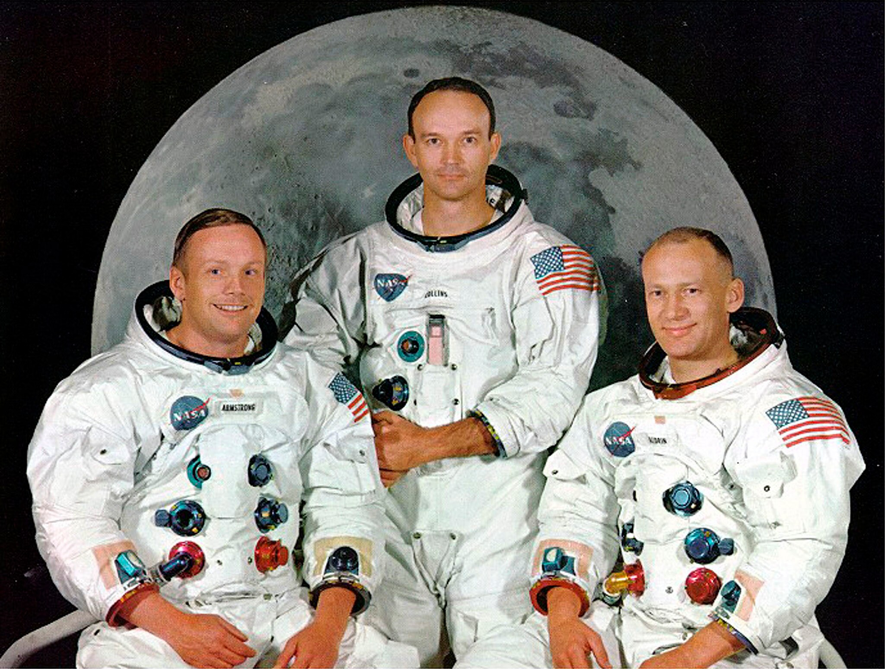

# The other side of Armstrong, Aldrin and Collins: decrypting the audio

On July 20th 1969, Neil A Armstrong, Buzz Aldrin and Michael Collins made history by being the first humans to arrive, land, walk and come back from the Moon.

The mission was a decisive milestone for NASA against the Soviet Union's space programme during the space race and is considered one of the most significant moments in human history.

600 million people around the world witnessed the Apollo 11 moon landing, and in the months that followed the political, media and social impact was enormous. The Apollo 11 crew was subjected to a busy schedule of receptions, parades, interviews and state protocol.

During the 9-day journey, every communication between Control Center and the astronauts was monitorized and stored. Later, NASA was able to analyze and transcript more than 20.000 lines of audio recorded during that amazing experience.

Follow this readme and enjoy the moon landing from the other perspective.

<b>👇👇👇 CHECK OUT THE PROMO TRAILER I'VE MADE. CLICK ON THE IMAGE (AUDIO ON) 👇👇👇</b>

## 1. Objective

The aim of this project is to perform sentiment analyses of the most stunning moments of the expedition: the moon landing and the moon walking of Neil Armstrong and Buzz Aldrin.

In order to plot the information, the data will be previously loaded into MySQL.

To retrieve the data, an API has been created with Flask that contains the necessary quiers to obtain the data.

In addition, this project ables anyone to insert their own message to the database by a post sequence.

## 2. Data acquisition

The database was extracted from https://github.com/clausd/Moon and it's originally transcripted from the Apollo Lunar Surface Journal, available online (html, pdf): https://www.hq.nasa.gov/alsj/a11/a11trans.html

## 3. How to use this repo

- Firstly, use the apollo11.csv provided in the data folder to create a MySQL schema called **apollo_transcripts** and create a table with the following structure:

    

- Secondly, open a terminal and execute **main.py** file, found in the root. The main file contains the necessary information to setup and execute the Flask API. It also connects to MySQL server and your table recently created.

    

- Thirdly, open a new tab in your web browser and use the link provided by the terminal to access the API. Try to run some queries to verify everything is correct.

    
    
- Open Analysis.ipynb and execute all the cells to show up the data analysis.

- Open Send_your_message.ipynb and follow the instructions inside to perform POSTs inside the MySQL database.

- Enjoy!

## Links and Resources

- https://www.hq.nasa.gov/alsj/a11/a11trans.html
- https://www.hq.nasa.gov/alsj/a11/a11transcript_pao.pdf
- https://github.com/clausd/Moon
- https://www.washingtonpost.com/national/the-apollo-11-mission-to-the-moon/2009/07/08/gIQAGGiBSN_gallery.html