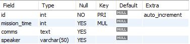
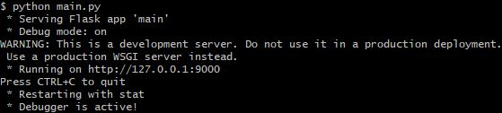
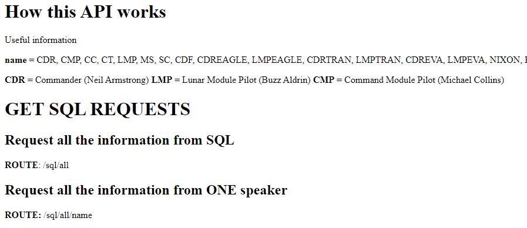
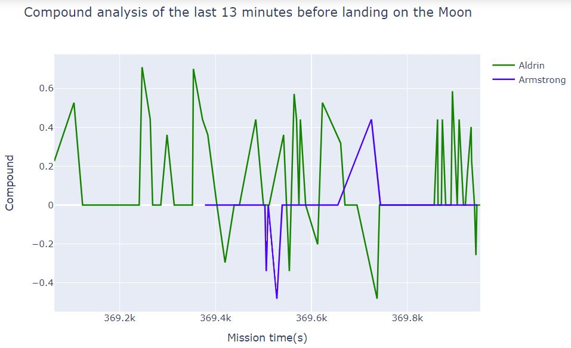
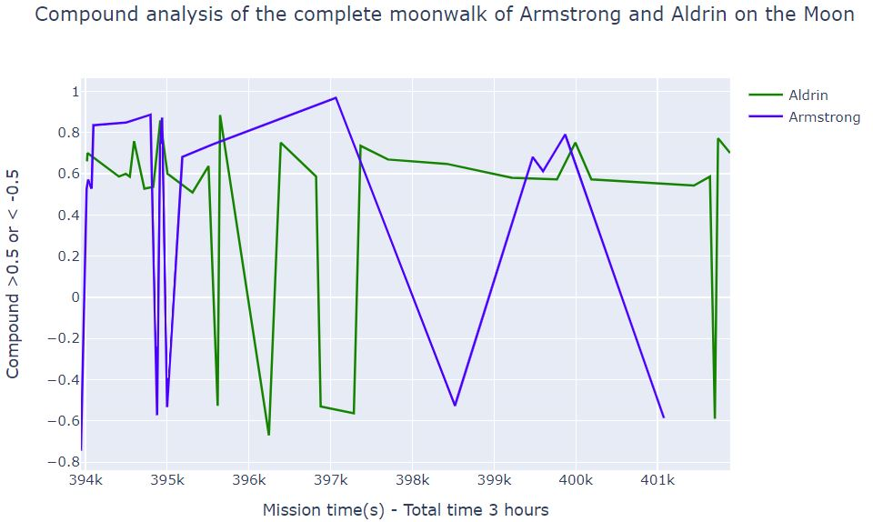
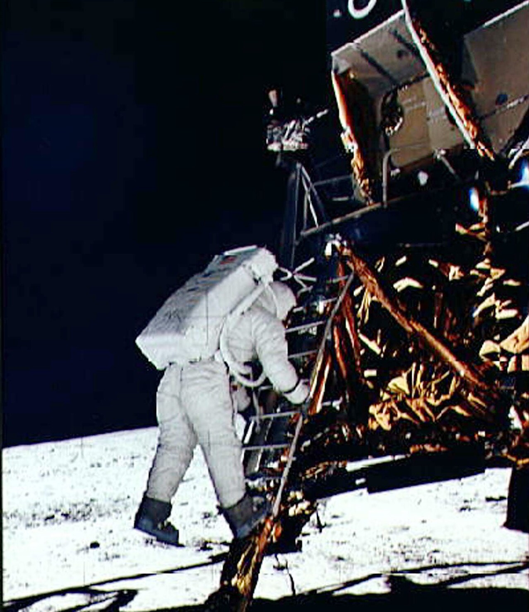
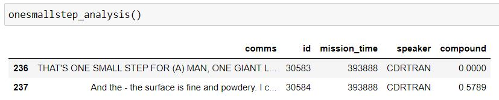
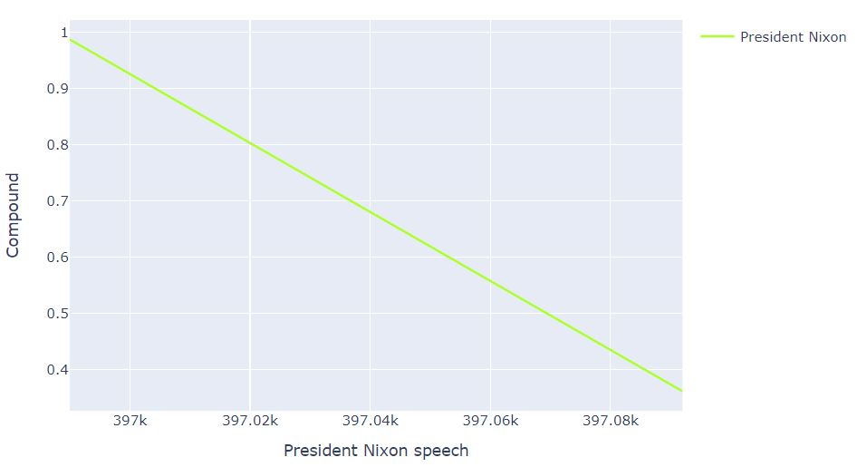

# The other side of Armstrong, Aldrin and Collins: decrypting the audio

On July 20th 1969, Neil A Armstrong, Buzz Aldrin and Michael Collins made history by being the first humans to arrive, land, walk and come back from the Moon.

The mission was a decisive milestone for NASA against the Soviet Union's space programme during the space race and is considered one of the most significant moments in human history.

600 million people around the world witnessed the Apollo 11 moon landing, and in the months that followed the political, media and social impact was enormous. The Apollo 11 crew was subjected to a busy schedule of receptions, parades, interviews and state protocol.

During the 9-day journey, every communication between Control Center and the astronauts was monitorized and stored. Later, NASA was able to analyze and transcript more than 20.000 lines of audio recorded during that amazing experience.

Follow this readme and enjoy the moon landing from the other perspective.

<b>👇👇👇 CHECK OUT THE PROMO TRAILER I'VE MADE. CLICK ON THE IMAGE (AUDIO ON) 👇👇👇</b>

## 1. Objective

The aim of this project is to perform sentiment analyses of the most stunning moments of the expedition: the moon landing and the moon walking of Neil Armstrong and Buzz Aldrin.

In order to plot the information, the data will be previously loaded into MySQL.

To retrieve the data, an API has been created with Flask that contains the necessary quiers to obtain the data.

In addition, this project ables anyone to insert their own message to the database by a post sequence.

## 2. Data acquisition

The database was extracted from https://github.com/clausd/Moon and it's originally transcripted from the Apollo Lunar Surface Journal, available online (html, pdf): https://www.hq.nasa.gov/alsj/a11/a11trans.html

## 3. How to use this repo

- Firstly, use the apollo11.csv provided in the data folder to create a MySQL schema called **apollo_transcripts** and create a table with the following structure:

    

- Secondly, open a terminal and execute **main.py** file, found in the root. The main file contains the necessary information to setup and execute the Flask API. It also connects to MySQL server and your table recently created.

    

- Thirdly, open a new tab in your web browser and use the link provided by the terminal to access the API. Try to run some queries to verify everything is correct.

    

- Open Analysis.ipynb and execute all the cells to show up the data analysis.

- Open Send_your_message.ipynb and follow the instructions inside to perform POSTs inside the MySQL database.

- Enjoy!

## 4. Function definitions

Summary of the tools folder:

- Call_speakers: uses API request to extract the necessary data to perform data analyses.
- Plots: uses Call_speakers functions to plot data.
- Postdelete: defines functions to POST or DELETE messages inside MySQL's database.
- sql_queries: the queries that will run the API in the main.py file.

## 5. Data analysis

### 5.1 The descent

The Apollo 11 lunar module Eagle took about 12 and a half to go from its orbital speed to a soft touchdown on Mare Tranquilitates. This was the first Apollo landing and it would prove to be the most arduous.

About 500 km from the landing site, Eagle's main engine would be ignited to begin the descent to the surface, an event called Power Descent Initation, or PDI.

Eagle problems began even as the spacecraft appeared from around the Moon's limb, it had been fitted with metal sheets below it's maneuvering thrusters to protect its lower section from their hot exhaust, but these were interfering with the reception pattern of his dish antenna.

Also, unknown to the astronauts an error in their trajectory had moved the probable landing six kilometers downrange of its intended spot and nearly into unplanned territory.

Once the burn began, further difficulties would mark Eagle's final descent to the surface.

**The following plot shows the complete sentiment analysis of the last 13 minutes of the landing approach phase, where various problem appear during the burnout**

The graph is divided into two parts: the Aldrin compound and the Armstrong compound. During the descent phase, Aldrin is the one taking control of the spacecraft, so he has the most interaction of the two. Armstrong was only in charge of overseeing the computer and Collins was left in charge of the Apollo spacecraft in orbit to the moon.

The sentimental analysis shows quite pronounced fluctuations, but much more positive than negative. However, the sentimental analysis fails to interpret some sentences.

Most of the positive sentences are those in which the pilots see that everything is in order and that they can continue. Some negative sentences are those where the alarm signal is raised.

I think it is especially important to note how cool the astronauts' minds were. They were not moved by anything and all their sentences obeyed commands. It is not until they reach the surface that they give more subjective details of what they are experiencing.

### 5.2. The moonwalk

Once in orbit, everything had to go very quickly because their life support was very limited.

The surface walk lasted approximately 3 hours. A sentimental analysis of this walk can be found in the following graph.

However, the graph has been limited to only those interactions that I considered to be very positive or very negative, i.e. >0.5 or <-0.5, otherwise the graph would be too heavy.

This graphic contains some emblematic moments from the surface walk. For example, on the second 394916 Aldrin and Armstrong chat about how comfortable they are in place.

The highest peak, at 397064, is Armstrong thanking President Nixon for the speech he made to them.

However, as in the previous case, the analysis fails for a supposedly positive sentence, marking it as very negative.

The descriptive statistical analysis is also noteworthy. For example, Armstrong has a wider spread of data than Aldrin, so he seems to provide more subjective views. However, it is true that the range is for both positive and negative, whereas Aldrin only reports positive comments.

### 5.3. One small step for a man, one giant leap for mankind

**It's really curious to see how the sentence that changed the course of the Cold War has a compound value of... ZERO** However, the following sentence gains more popularity.

### 5.4. President Nixon speech

Richard Nixon telephoned via satellite the astronauts on the Moon. His speech was also transcribed and analyzed via sentiment analysis

## 6. Links and Resources

- https://www.hq.nasa.gov/alsj/a11/a11trans.html
- https://www.hq.nasa.gov/alsj/a11/a11transcript_pao.pdf
- https://github.com/clausd/Moon
- https://www.washingtonpost.com/national/the-apollo-11-mission-to-the-moon/2009/07/08/gIQAGGiBSN_gallery.html